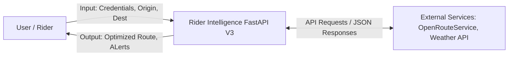
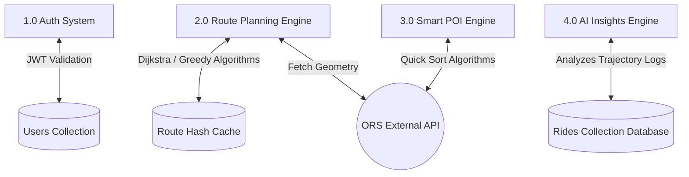
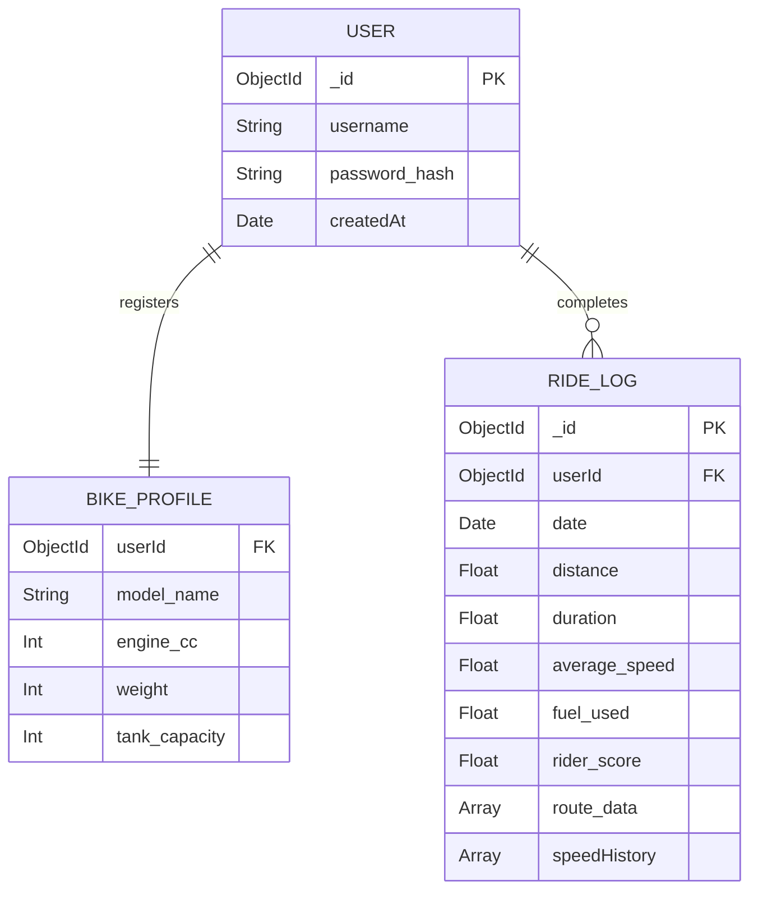

# Rider Intelligence - System Architecture Diagrams

This document contains the structural blueprints for the Rider Intelligence Phase 3 platform (FastAPI Python + MongoDB + React).

## DFD Level 0 (Context Diagram)

This represents the highest-level view of the application boundary, showing how external entities interact with the core system.

---

## DFD Level 1 (Internal Services)

This diagram details the internal flow of data between the major modular engines executing the Python algorithms.

---

## Entity-Relationship (ER) Diagram

This diagram maps out the relationships and fundamental structure arrays of the NoSQL MongoDB implementation storing rider metrics.

